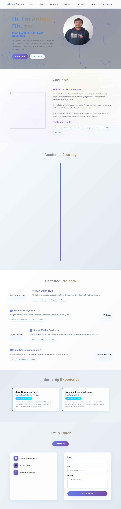
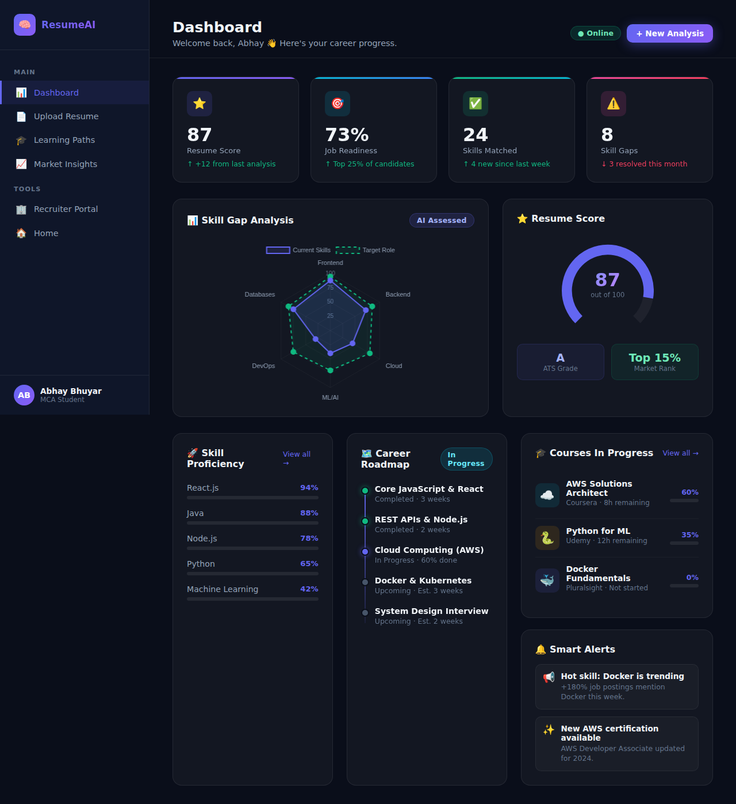
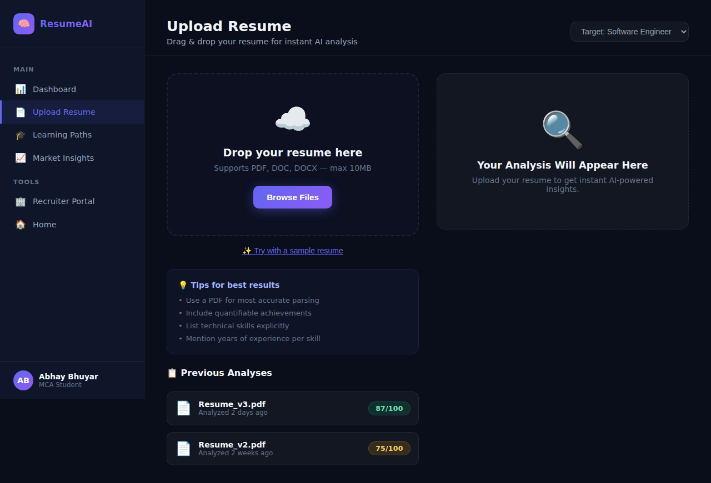
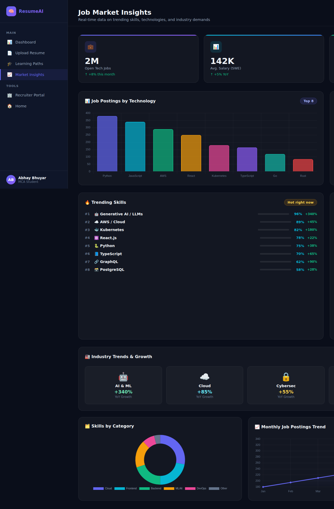
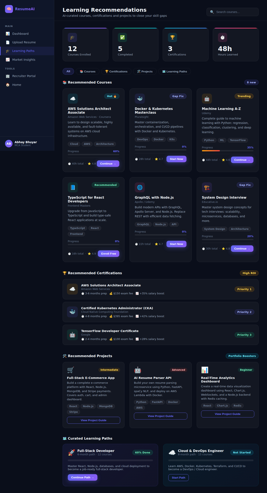
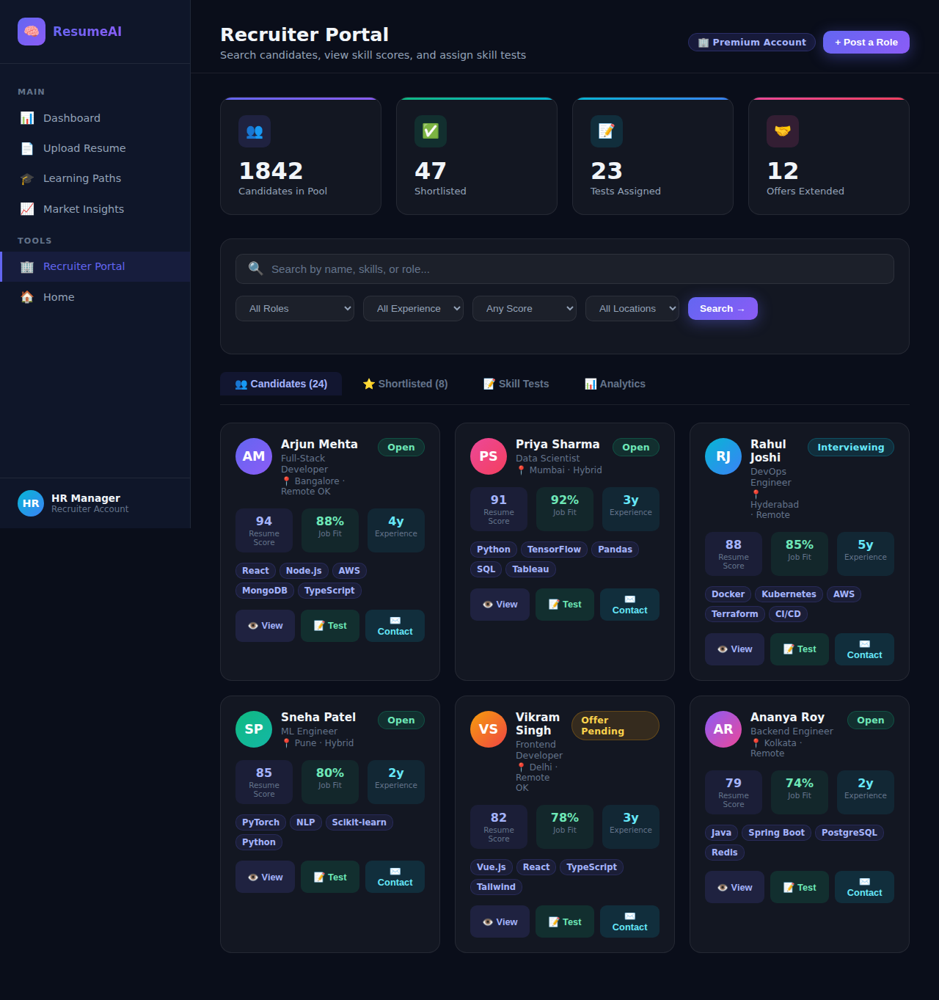

# Portfolio + ResumeAI – Intelligent Resume Analysis System

A static front-end project built with **HTML, Vanilla CSS, JavaScript, and Chart.js**.

🔗 **Live site:** https://abhaybhuyar0709.github.io/Portfolio/

[](https://github.com/abhaybhuyar0709/Portfolio/actions/workflows/deploy.yml)

---

## 🚀 Run the project — three ways

### Option 1 — Open directly in a browser (zero setup)

Just double-click any `.html` file (e.g. `index.html`) to open it in your browser.
No server or installation needed for basic browsing.

### Option 2 — Local dev server with live reload (recommended)

```bash
# 1. Install tools (only once)
npm install

# 2. Start hot-reload dev server
npm run dev
```

Your default browser opens automatically at **http://localhost:3000**.  
Every time you save a `.html`, `.css`, or `.js` file the browser refreshes instantly.

### Option 3 — Static server (production-like preview)

```bash
npm install      # only needed once
npm start        # serves at http://localhost:3000
```

Then open **http://localhost:3000** in any browser.

### Option 4 — Live production site (no install needed)

The site auto-deploys to GitHub Pages on every push to `main`.  
Visit the live URL: **https://abhaybhuyar0709.github.io/Portfolio/**

---

## 📸 Page previews

### Portfolio Home (`index.html`)


### ResumeAI Landing (`resumeai.html`)


### Dashboard (`dashboard.html`)


### Resume Upload (`upload.html`)


### Job Market Insights (`insights.html`)


### Learning Recommendations (`learning.html`)


### Recruiter Portal (`recruiter.html`)


---

## Pages

| Page | File | Description |
|------|------|-------------|
| Portfolio Home | `index.html` | Personal portfolio landing page |
| ResumeAI Home | `resumeai.html` | AI resume analysis landing page |
| Dashboard | `dashboard.html` | User career-progress dashboard |
| Resume Upload | `upload.html` | Drag-and-drop resume upload + analysis |
| Learning Recommendations | `learning.html` | Courses, certifications & learning paths |
| Job Market Insights | `insights.html` | Trending skills & industry data |
| Recruiter Portal | `recruiter.html` | Search & evaluate candidate profiles |

---

## Validate HTML

```bash
npm install      # only needed once
npm test         # validates all HTML pages — exits 0 means all passed
```

---

## Project structure

```
Portfolio/
├── index.html          # Portfolio landing page
├── resumeai.html       # ResumeAI landing page
├── dashboard.html      # User dashboard
├── upload.html         # Resume upload page
├── learning.html       # Learning recommendations
├── insights.html       # Job market insights
├── recruiter.html      # Recruiter portal
├── style.css           # Portfolio styles
├── resumeai.css        # ResumeAI shared styles
├── script.js           # Portfolio scripts
├── resumeai.js         # ResumeAI shared scripts
├── chart.min.js        # Chart.js (bundled locally)
├── screenshots/        # Page preview screenshots
├── package.json        # npm scripts (start / dev / test)
├── .htmlvalidate.json  # HTML validation config
└── .github/
    └── workflows/
        └── deploy.yml  # GitHub Actions → GitHub Pages auto-deploy
```

